# 项目内容
 
 使用muduo网络库搭建网络核心模块、Nginx实现聊天服务器的集群，提高并发能力、Redis作为消息中间件、MySQL作为数据存储、json序列化和反序列化作为通信协议的实时聊天服务器。

# 开发环境

Centos 7 + VsCode远程Linux开发、Cmake构建、Linux Shell输出项目编译脚本

# 安装说明

[1、Linux下安装Nginx并配置Tcp负载均衡](https://blog.csdn.net/m0_51415606/article/details/136977846?spm=1001.2014.3001.5502)

[2、Linux下安装MySQL](https://blog.csdn.net/m0_51415606/article/details/137205044?spm=1001.2014.3001.5502)

[3、Linux下安装Redis](https://blog.csdn.net/m0_51415606/article/details/126886492)

4、安装CMake

# 编译说明

有两种方式：

1、运行autobuild.sh脚本

2、使用cmake命令编译

``` c++
cd build
cmake ..
make
```

# 技术介绍

1、使用muduo网络库作为项目的网络核心模块，提供高并发网络IO服务，解耦网络和业务模块代码；

 2、使用json序列化和反序列化消息作为私有通信协议；
 
 3、配置nginx基于tcp的负载均衡，实现聊天服务器的集群功能，提高后端服务的并发能力；

4、基于redis的发布-订阅功能，实现跨服务器的消息通信；

5、使用mysql关系型数据库作为项目数据的落地存储；

6、使用连接池提高数据库的数据存取功能。

# 项目架构

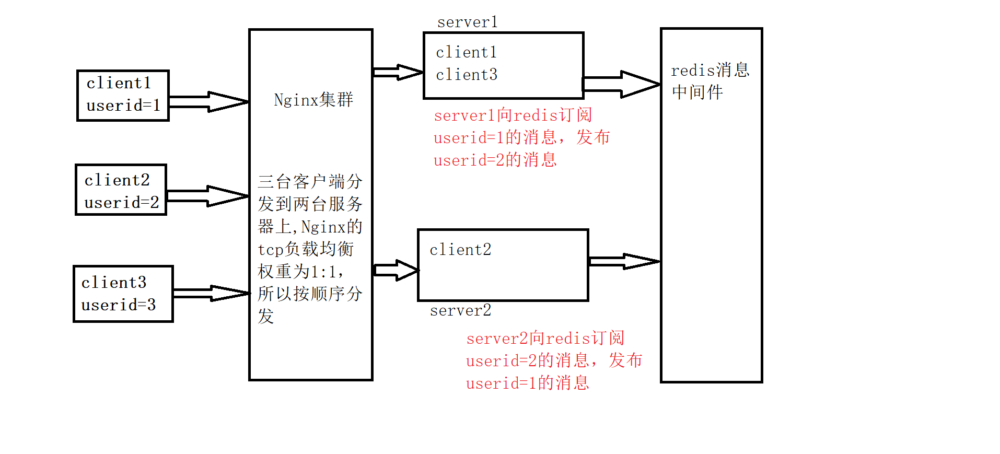

# 项目目录


- autobuild.sh：一键编译脚本
 - chat.sql：创建数据库表的sql脚本
 - bin：存放服务器和客户端的可执行程序
 - build：cmake编译生成的临时文件
 - CMakeLists.txt：项目使用cmake作为编译环境
 - include：项目的头文件
 - src：项目的源文件
 - test：muduo网络库使用的demo和json序列化和反序列化的demo
 - thirdparty：存放json.hpp

# 数据库设计

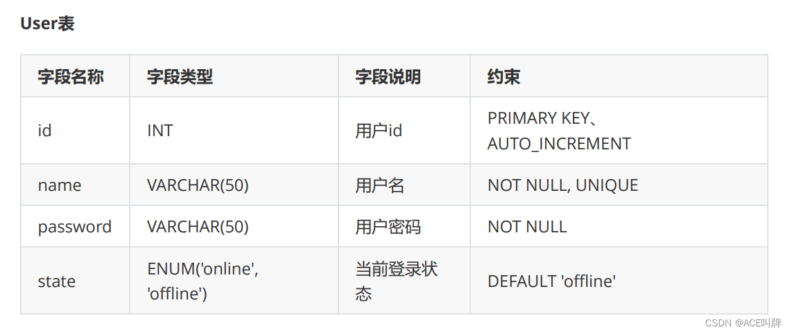


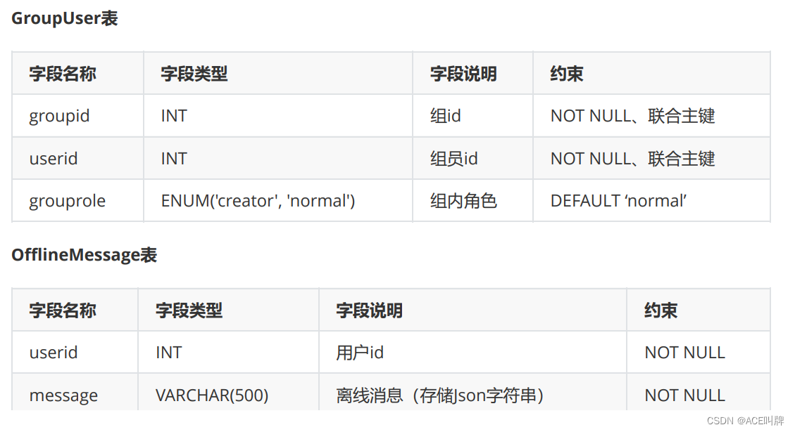

# 项目介绍

**功能分为：登录账号、注册账号、退出账号、一对一聊天业务、创建群聊业务、加入群聊业务、群内发消息业务、添加好友业务、离线消息存储业务。**

**特别说明：以下示例已经启动Nginx和redis-server，Nginx集群了两台服务器，端口分别为6000、6002。**

## 启动服务器

这里启动两台服务器，因为Nginx配置tcp负载均衡时配置了两台。


## 启动客户端

同样启动两台客户端进行聊天业务。


## 注册账号


wang wu用户注册成功，他的用户id为3，登录时通过用户id去登录。

## 登录成功


两台客户端分别登录了两个用户，用户id分别为1和3，可以看到用户id为1的用户已经添加了好友和群聊，但是id为3的用户还没有添加任何好友和群聊。

## 一对一聊天业务

现在进行id=3和id=1之间聊天，不是好友也可以互相聊天。

一对一聊天的命令行输入为：chat:用户id:内容


## 创建群聊业务

创建群聊的命令行：creategroup:群聊名:群聊描述

创建群聊的人权限为创建者。

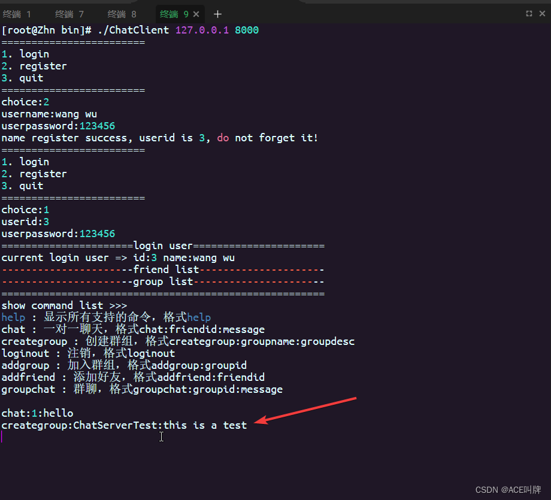


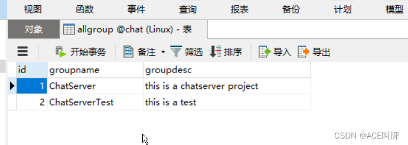


可以看到，数据库里群聊已经创建成功，群聊id为2，userid=3的用户在groupid=2的群里的权限为创建者。

## 加入群聊业务


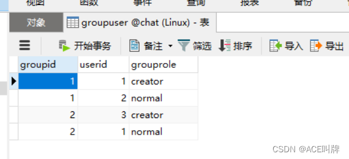

userid=1的用户加入groupid=2的群，他的权限为普通权限。

## 群聊业务

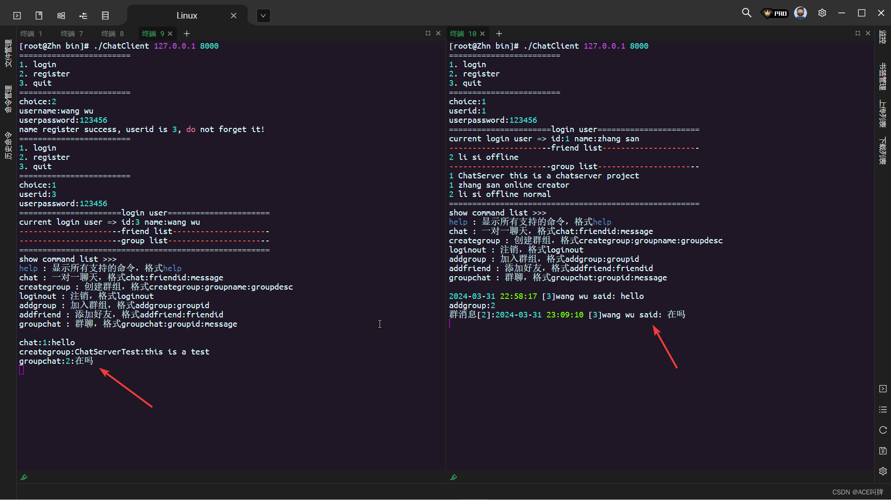

userid=3的用户在groupid=2的群里发了一条消息，群内成员收到了这条消息。

## 添加好友业务

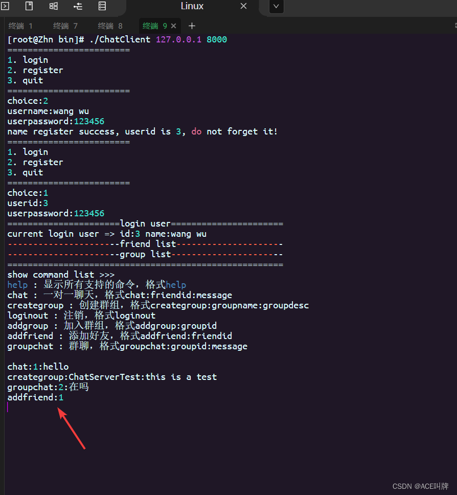

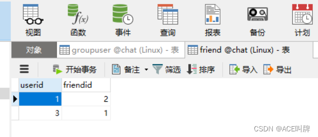

可以看到，userid=3的用户有一个好友，好友id=1，即userid=1的用户。

## 离线消息存储业务

现在我们让userid=3的用户退出，userid=1的用户持续为他发消息。

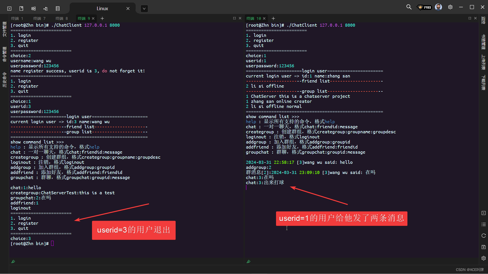


数据库里已经存了两条消息，但是中文乱码了，不影响结果。

现在我们让userid=3的用户重新登录。

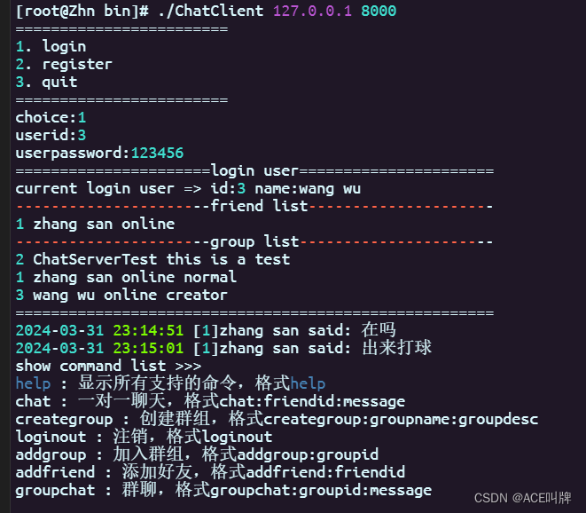

刚刚添加的好友、群聊、离线消息在重新登录之后都成功显示出来了。

# 特殊说明

要使程序成功跑起来，需要在db.cpp的数据库ip和密码改成自己本机的ip和密码。

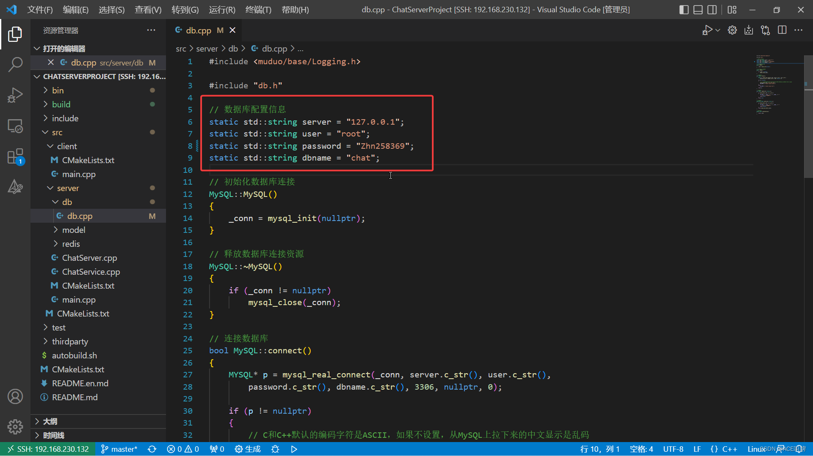
